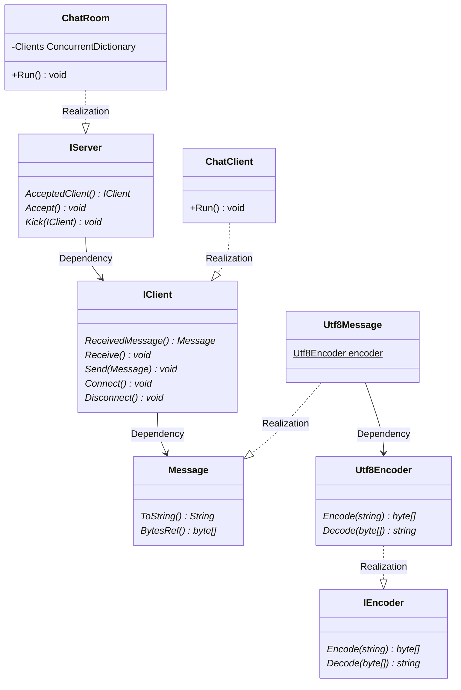
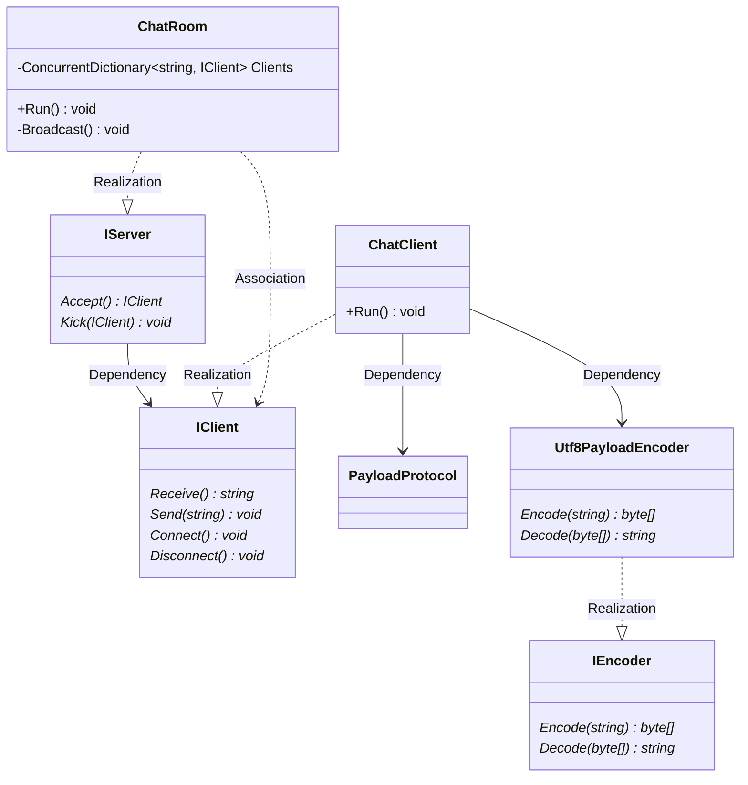
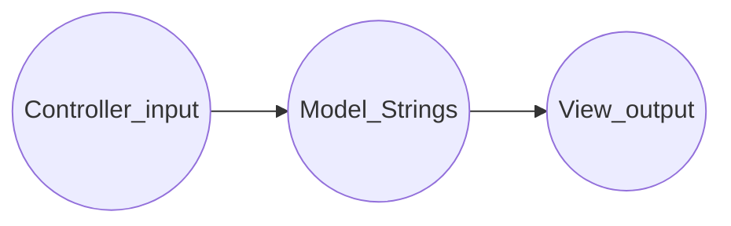
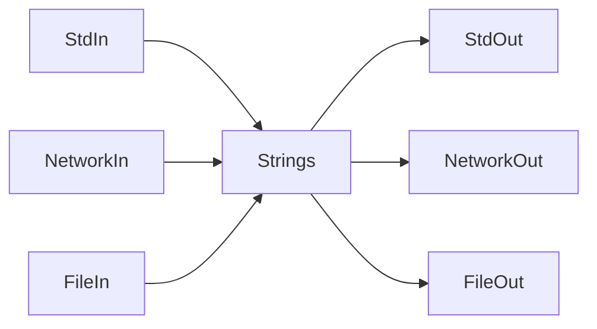
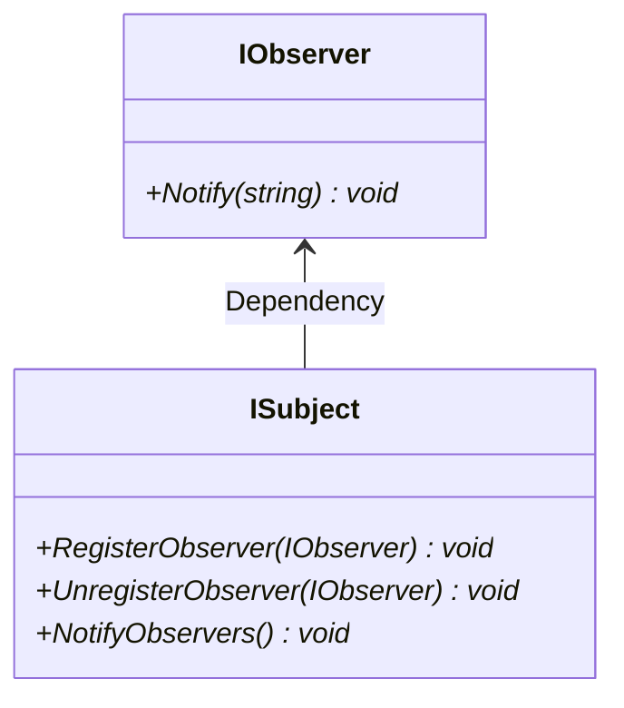
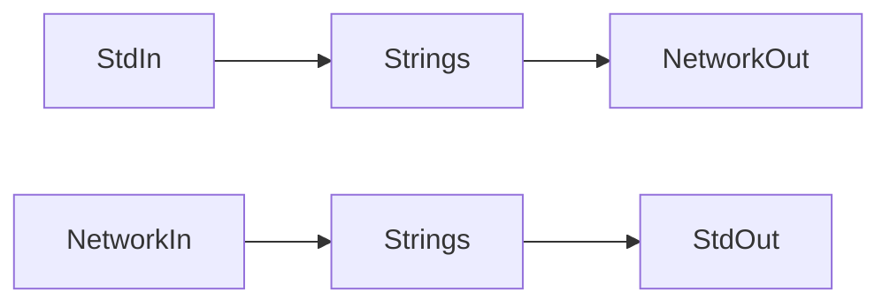
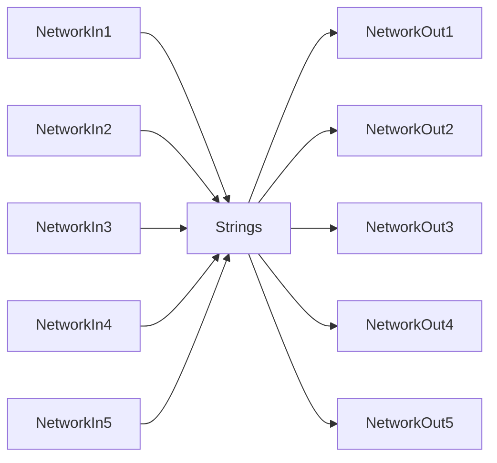
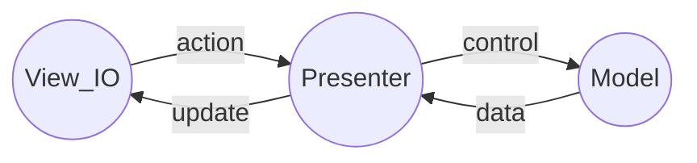
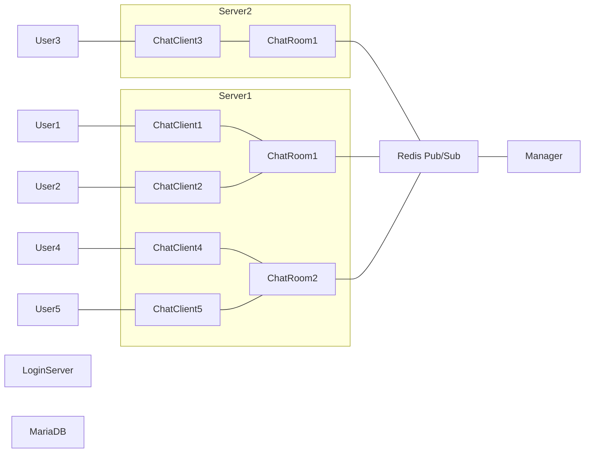
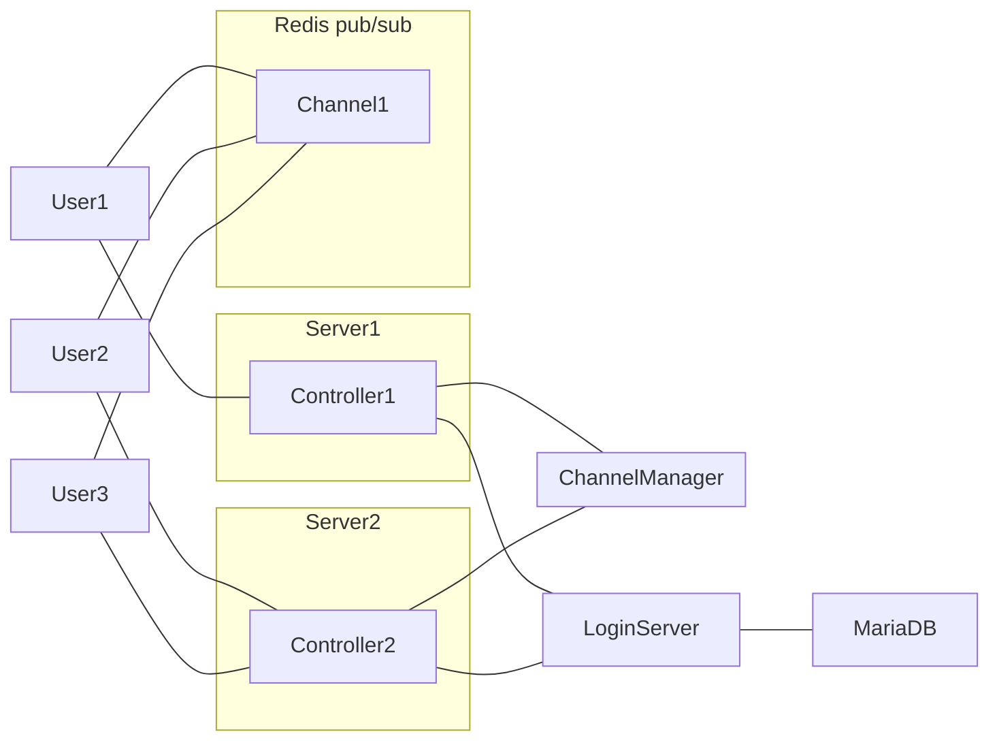

# Class Diagram V1

# Class Diagram V2

# Design Pattern
## MVC

## Client

## Server

## MVP

* View and Presenter must be bijection

# Service Architecture V1

# Service Architecture V2

# Strategy
|Component|Scalability|High Availability|
|---|---|---|
|dotnet|create new process|auto restart|
|Redis|cluster|sentinel|

# Naming Convention
https://docs.microsoft.com/en-us/dotnet/standard/design-guidelines/names-of-classes-structs-and-interfaces
