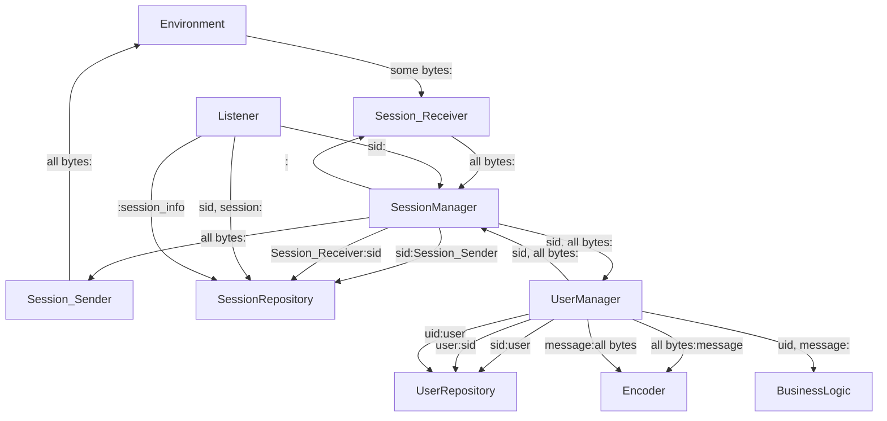

# chat-0.4 call graph 
* A -> B : A Calls B's function
    * function notation
        * param1,param2,...,paramN:return
* Use the queue to ask the manager for Job

```mermaid
flowchart TD
    Environment --> |some bytes:| Session_Receiver
    Session_Sender --> |all bytes:| Environment
    Session_Receiver --> |all bytes:| SessionManager
    SessionManager --> |all bytes:| Session_Sender
    
    SessionManager --> |sid:Session_Sender| SessionRepository
    SessionManager --> |Session_Receiver:sid| SessionRepository

    Listener --> |sid, session:| SessionRepository
    Listener --> |:session_info| SessionRepository
    Listener --> |sid:| SessionManager
    SessionManager --> |:| Session_Receiver

    SessionManager --> |sid, all bytes:| UserManager
    UserManager --> |sid, all bytes:| SessionManager

    UserManager  --> |sid:user| UserRepository
    UserManager  --> |user:sid| UserRepository
    UserManager  --> |uid:user| UserRepository

    UserManager --> |all bytes:message| Encoder
    UserManager --> |message:all bytes| Encoder

    UserManager --> |uid, message:| BusinessLogic

```